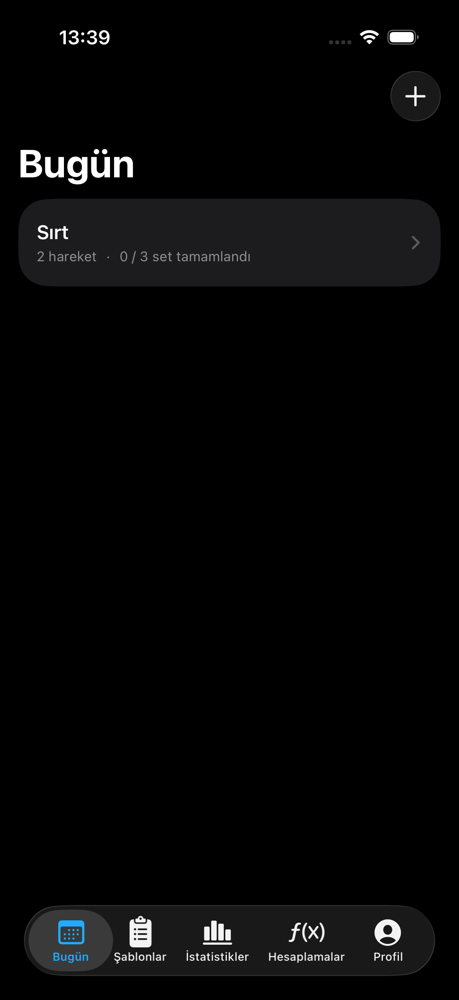
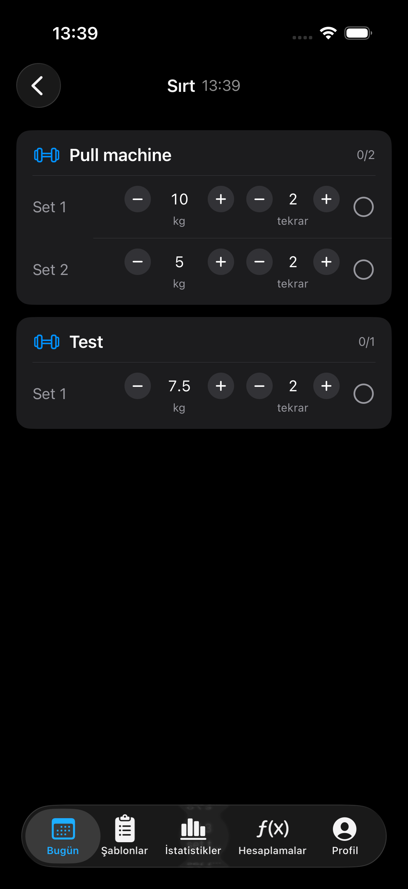
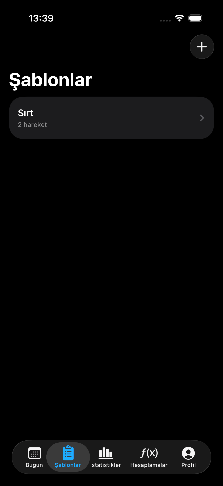
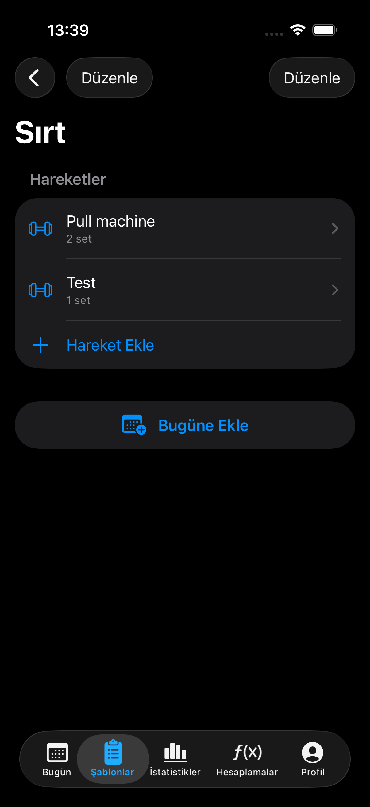
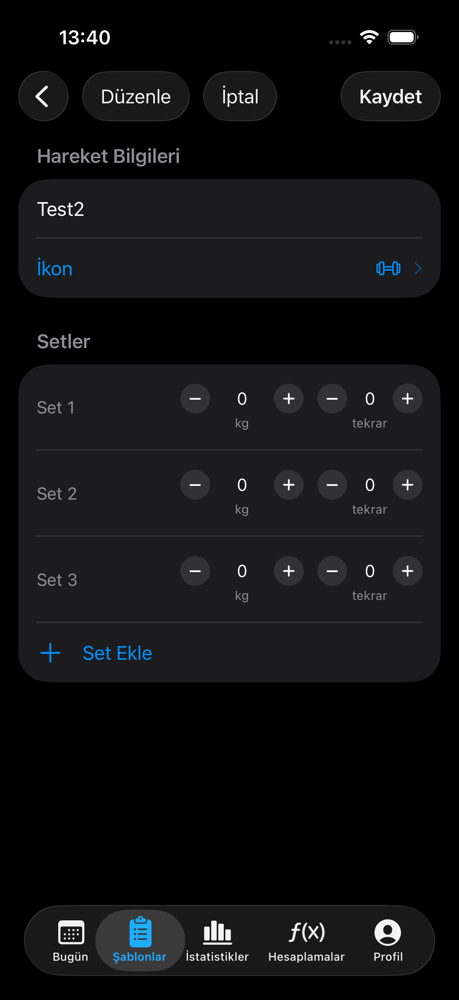
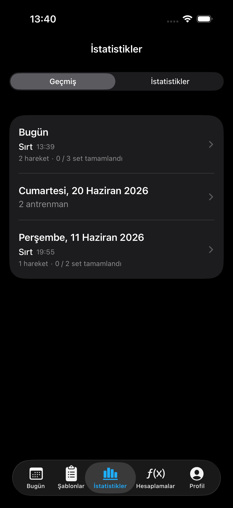
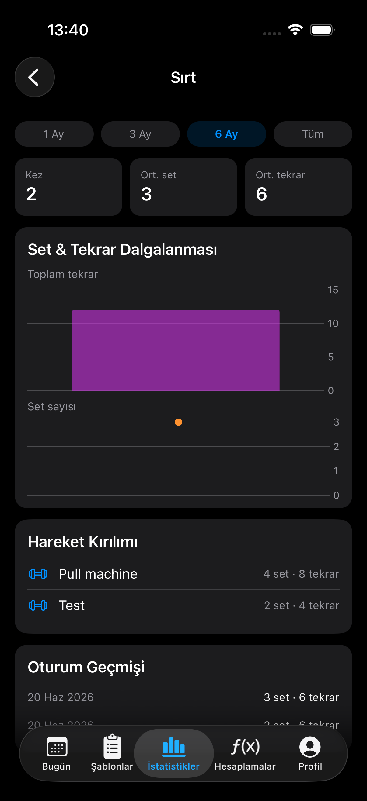
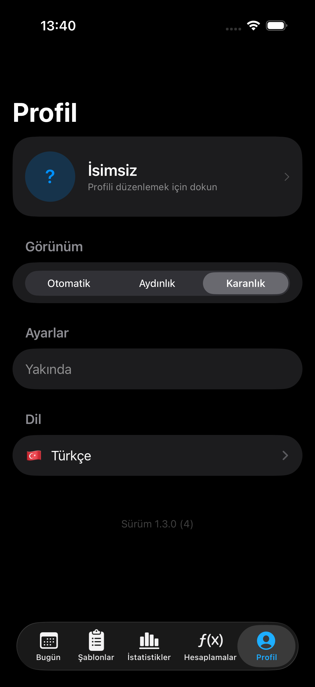

# 🏋️ Workout Tracker

**Salonda defter, not uygulaması ya da hafızayla uğraşmadan antrenmanını kaydet.**
Şablonunu bir kez oluştur, her antrenmanda tek dokunuşla başlat, setlerini `−` / `+` ile işaretle — bir sonraki antrenmanda uygulama son kaldırdığın ağırlığı ve tekrarı hatırlıyor olsun.


---

## 📸 Ekran Görüntüleri

<table>
  <tr>
    <td align="center"><br/><b>Bugün</b></td>
    <td align="center"><br/><b>Antrenman Seansı</b></td>
    <td align="center"><br/><b>Şablonlar</b></td>
    <td align="center"><br/><b>Şablon Detayı</b></td>
  </tr>
  <tr>
    <td align="center"><br/><b>Hareket Düzenleme</b></td>
    <td align="center"><br/><b>Geçmiş</b></td>
    <td align="center"><br/><b>İlerleme İstatistikleri</b></td>
    <td align="center"><br/><b>Profil</b></td>
  </tr>
</table>

| Ekran | Ne gösteriyor? |
|---|---|
| **Bugün** | Günün antrenmanları ve ilerleme özeti (`2 hareket · 0 / 3 set tamamlandı`); `+` ile şablondan yeni antrenman başlatma |
| **Antrenman Seansı** | Hareket kartları, her set için kg (2,5 kg adım) ve tekrar stepper'ları, tek dokunuşla set tamamlama |
| **Şablonlar** | Kayıtlı antrenman programları ve içerdikleri hareket sayısı |
| **Şablon Detayı** | Şablondaki hareketler, "Hareket Ekle" ve şablonu tek dokunuşla güne ekleyen "Bugüne Ekle" |
| **Hareket Düzenleme** | Hareket adı, ikon seçimi ve varsayılan setlerin kg/tekrar değerleri, "Set Ekle" |
| **Geçmiş** | Günlere göre gruplanmış antrenmanlar (Bugün / tam tarih), saat ve set özeti; aynı gün birden fazla antrenman desteği |
| **İlerleme İstatistikleri** | 1 Ay / 3 Ay / 6 Ay / Tüm aralıkları, KPI kartları, tekrar & set grafikleri, hareket kırılımı, oturum geçmişi |
| **Profil** | Profil bilgisi, Otomatik / Aydınlık / Karanlık tema, dil seçimi, sürüm bilgisi |

---

## 🎯 Hangi Sorunu Çözüyor?

Salonda antrenman yaparken en sık yaşanan dertler:

- **"Geçen hafta bu harekette kaç kilo kaldırmıştım?"** — Not defteri ya da telefon notlarında eski kayıtları aramak setler arası dinlenmeyi yiyip bitiriyor.
- **Her antrenmanda aynı programı baştan yazmak** — Genel not uygulamalarında hareketleri, set sayılarını ve ağırlıkları her seferinde yeniden girmek gerekiyor.
- **Terli ellerle klavye kullanmak** — Set arasında küçük sayı klavyesiyle kg/tekrar yazmak hem yavaş hem hataya açık.
- **İlerlemeyi görememek** — Kayıtlar dağınık olunca haftalar içinde gerçekten gelişip gelişmediğini anlamak zorlaşıyor.

**Workout Tracker** bunları şöyle çözer:

| Sorun | Çözüm |
|---|---|
| Son ağırlığı hatırlamamak | Tamamlanan her setin kg/tekrarı **otomatik olarak şablona geri yazılır**; bir sonraki antrenman son değerlerle başlar. |
| Programı her seferinde yazmak | Program bir kez **şablon** olarak oluşturulur, sonra tek dokunuşla o güne eklenir. |
| Set arasında klavye | Klavye yok: ağırlık **2,5 kg**, tekrar **1'er** adımla `−` / `+` butonlarıyla ayarlanır. |
| İlerlemeyi görememek | **Geçmiş** ve **İstatistik** ekranları seans sayısını, ortalama set/tekrarı ve zaman içindeki dalgalanmayı grafikle gösterir. |

---

## ✨ Özellikler

### 📅 Bugün
- Kayıtlı şablonlardan birini seçerek günün antrenmanını başlatma
- Aynı gün içinde birden fazla antrenman (ör. sabah kardiyo + akşam ağırlık)
- Her antrenman için egzersiz sayısı ve `tamamlanan / toplam set` özeti
- Uzun basarak antrenmanı silme (onaylı)

### 🏃 Antrenman Seansı
- Egzersiz kartları ve her set için **kg** ve **tekrar** stepper'ları
- Tek dokunuşla seti tamamlama ✅ — tamamlanan set kilitlenir ve soluklaşır
- **Sağa kaydır → Kopyala:** Aynı kg/tekrar ile ekstra set ekle (şablonu etkilemez)
- **Sola kaydır → Sil:** Seti sadece o günkü seanstan kaldır
- Egzersize uzun bas → egzersizi o seanstan çıkar
- Tamamlanan setin değerleri, kaynağı olan şablon setine **otomatik senkronize** edilir

### 📋 Şablonlar
- Antrenman şablonu oluşturma / düzenleme / silme
- Şablona egzersiz ekleme, her egzersiz için varsayılan set, kg ve tekrar tanımlama
- **İkon seçici** ile egzersizleri SF Symbols ikonlarıyla kişiselleştirme
- Egzersizleri ve setleri **sürükle-bırak** ile yeniden sıralama
- **"Bugüne Ekle"** ile şablonu doğrudan günün antrenmanı yapıp Bugün sekmesine geçme

### 📊 İstatistikler
- **Geçmiş:** Tüm antrenmanlar gün bazında gruplanır (Bugün, Dün, tam tarih); saatleriyle birlikte listelenir
- **İstatistik:** Her antrenman programı için ilerleme detayı
  - Zaman aralığı: **1 Ay / 3 Ay / 6 Ay / Tüm**
  - KPI kartları: yapılma sayısı, ortalama set, ortalama tekrar
  - **Tekrar** (bar grafik) ve **set** (çizgi grafik) dalgalanması — Swift Charts
  - Egzersiz bazında set/tekrar dağılımı ve seans geçmişi
- Yalnızca gerçekten **tamamlanan** setler hesaba katılır

### 👤 Profil
- Ad, soyad ve profil fotoğrafı
- Tema: **Otomatik / Aydınlık / Karanlık**
- Uygulama içinden anında dil değiştirme

### 🌍 Çoklu Dil
🇹🇷 Türkçe · 🇬🇧 English · 🇪🇸 Español · 🇷🇺 Русский — sistem dili otomatik algılanır.

### 🧮 Hesaplamalar *(yakında)*
Fitness hesaplamaları için ayrılmış sekme.

---

## 🧠 Nasıl Çalışır?

Uygulama **Şablon → Seans** ayrımı üzerine kuruludur:

```
WorkoutTemplate ──► ExerciseTemplate ──► SetTemplate (defaultKg, defaultReps)
       │                                        ▲
       │  TemplateSessionBuilder.build(from:)   │  TemplateDefaultUpdater.syncIfNeeded(...)
       ▼                                        │  (set tamamlanınca kg/tekrar geri yazılır)
WorkoutSession ───► ExerciseSession ───► SetSession (kg, reps, isCompleted)
```

1. **Şablon** bir kez oluşturulan plandır (ör. "Push Day": Bench Press 4×8 @ 60 kg).
2. Antrenman başlatıldığında `TemplateSessionBuilder` şablonun bir **anlık kopyasını** (seans) oluşturur.
3. Seans sırasında yapılan değişiklikler (set kopyalama, silme) şablonu bozmaz.
4. Bir set tamamlandığında `TemplateDefaultUpdater` gerçek kg/tekrarı şablondaki sete yazar — **progressive overload** kendiliğinden takip edilir.
5. Seanslar egzersiz adı ve ikonunun **snapshot**'ını tutar; şablon sonradan değişse ya da silinse bile geçmiş kayıtlar bozulmaz.

---

## 🛠 Teknolojiler

| Katman | Teknoloji |
|---|---|
| UI | SwiftUI |
| Veri | SwiftData (`@Model`, `@Query`, `@Bindable`) |
| Grafikler | Swift Charts |
| Lokalizasyon | String Catalog (`Localizable.xcstrings`) + `LocalizationManager` |
| Mimari | ViewModel'siz; iş mantığı `Services/` altında |

Harici bağımlılık yoktur — sadece Apple framework'leri.

---

## 📁 Proje Yapısı

```
workout-tracker/
├── App/            # RootView (TabView), TabRouter
├── Models/         # Workout/Exercise/Set × Template/Session (SwiftData)
├── Services/       # TemplateSessionBuilder, TemplateDefaultUpdater
├── Views/
│   ├── Today/          # Bugün, seans detayı, set satırları
│   ├── Templates/      # Şablon listesi, detay, düzenleme
│   ├── Stats/          # Geçmiş, istatistik, ilerleme grafikleri
│   ├── Calculations/   # Hesaplamalar (yakında)
│   └── Profile/        # Profil, tema, dil ayarları
├── Components/     # SwipeRow, IconPickerView
└── Helpers/        # Lokalizasyon, tema, tarih/sayı formatlama, istatistik yardımcıları
```

---

## 🚀 Kurulum

**Gereksinimler:** Xcode 26+, iOS 26.4+

```bash
git clone https://github.com/sedatbilece/workout-tracker.git
cd workout-tracker
open workout-tracker.xcodeproj
```

Xcode'da `workout-tracker` şemasını seçip bir simülatör ya da cihazda çalıştırın (`⌘R`).

---

## 🗺 Yol Haritası

- [x] Şablon tabanlı antrenman yönetimi
- [x] Set tamamlama ve şablona otomatik senkron
- [x] Set kopyalama / silme (kaydırma hareketleri)
- [x] Çoklu dil desteği (TR, EN, ES, RU)
- [x] Geçmiş ve antrenman bazlı ilerleme istatistikleri
- [ ] Egzersiz bazlı istatistikler (maks. ağırlık, hacim trendi)
- [ ] Hesaplamalar sekmesi (1RM, plaka hesaplayıcı vb.)
- [ ] Set arası dinlenme zamanlayıcısı

Sürüm geçmişi için [CHANGELOG.md](CHANGELOG.md) dosyasına bakın.
